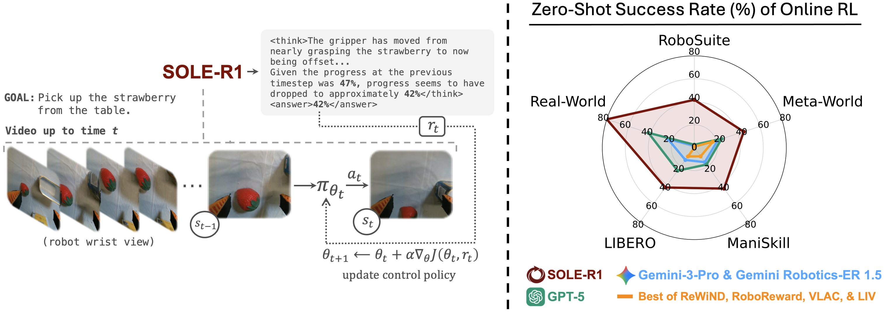

# SOLE-R1: Video-Language Reasoning as the Sole Reward for On-Robot RL
This repository contains the official implementation of the methods proposed in the paper:

> SOLE-R1: Video-Language Reasoning as the Sole Reward for On-Robot RL

SOLE-R1 is a video-language reasoning model designed for guiding online RL with per-timestep CoT reasoning and progress prediction.

  

---
### 📄 Paper (arXiv) - coming soon!
https://arxiv.org/abs/2508.01943

<!-- ### 📄 Project page 
https://sole-r1.github.io
 -->

## 🎥 Demos

Example videos demonstrating SOLE-R1 frame-level reasoning and task progress prediction can be found at:

https://sole-r1.github.io

---

## 📦 Training Dataset

Will soon be uploaded to HuggingFace!

---

## 📄 License

This project is released under the MIT License unless otherwise specified.  
See the LICENSE file for details.

---

## 🙋 Contact

For questions or issues, please open a GitHub Issue or contact the authors directly.

---

